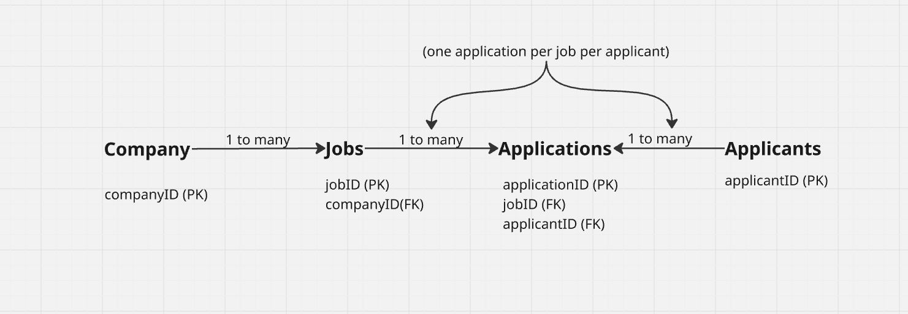

## Key Takeaways

## Part A — The decision

### Why this database, for this project
In 3–4 sentences, explain why you chose a relational database for your job portal. Name the two job-portal requirements that drove it hardest, and why those two specifically.

The reason to choose relational db is that our data is inherently relational, applications are related and dependent on the applicants and jobs and the jobs are dependent on the company. So the data is overall linked and with this linked data we need to implement cascading and joins for specific queries like listing all applications for a specific job. Performing these queries manually in the backend code would lead to n+1 query problem. So for reasons like these relational databases are more suited as they provide these features already.

### Where you'd lose — and why you still don't switch
Name one honest case in your portal where a pure document model would genuinely fit better (think about the wildly varying job attributes, or high-volume "job viewed" events). Then explain why you still don't add a second database for it.

In my case the attributes for a job change rapidly across different jobs etc.. so it gets tough to maintain a schema for these changing attributes for this specific type of data non-relational db's are more suitable. But I did not choose to go with it as first off this is a smaller problem as compared to the problems we will face with using non-relational db, secondly this problem can be minimized too if we absolutely make the job fields strict. There is a hybrid approach available too where for this specific data we can use jsonb to get the best of both worlds.

---

## Part B — The topics you just learned

### Relational vs document
In your own words, what's the core difference between the two families — what does each one store, and what does each one enforce (or leave to your application code)?

relational database stores columns and is suitable for data that is related to one another and for which the schema is fixed, while document-based databases store data who's schema is not defined and is more like the data that is self-contained (encompassing everything needed at one place or page). Relational database enforces ACID principles while the document databases leave this to the application code.

### Transactions & atomicity
What is a transaction? Using your application submission (a shortlist spanning two companies, becoming one application per job), explain what atomicity means here and the exact bad state you'd risk without it.

Transaction is a sequence of some steps that are grouped together and are executed step by step to serve an overall common purpose. Atomicity means that the transactions step either all complete or none does. e.g. if we are at step 3 of the transaction with remaining 2 steps and the transaction somehow fails due to any reason, now following the atomicity principle the system should undo the step 2 and step 1 as well.

### Foreign keys & referential integrity
What does a foreign key guarantee? Using applications.job_id → jobs.id, name two things the database will now refuse to do.

Foreign keys in a table point to the data in another table. These are to establish the relation between different tables. Foreign key enforces referential integrity between tables. Database with the provided relation would not allow an application with an invalid job_id that does not actually exist and it would not let you delete a job with applications or it would need to delete all the applications associated with the job.

### Joins
What is a join, in one sentence? Give one screen your portal renders constantly that needs one, name the tables it touches, and say what would go wrong (in query terms) without joins.

Joins are used to query across different tables to get a unified result from specific information across those tables as a new table. For the screen to list the companies and there posted jobs we need to join the jobs and the specific companies. Without joins we would have to traverse manually through the data and provide output based on specific companies and the jobs listings they have taking more time and increasing chances of errors or mishandling.

### The JSONB hybrid
How does Postgres let you keep relational guarantees and store wildly varying per-role attributes? For your jobs table, name two fields that belong in real columns and two in the JSONB attributes field — and justify each placement.

Postgress provides support for relational data in columns form as well as the option to store data as documents a hybrid approach. The document support is JSONB which stores the document and indexes it to allow queries based in ids too. For the jobs  jobid and companyid would be in column and specific perks related to the job and the information about hiring pipeline vary significantly so these two would be stored as JSONB attributes.

## Quick quiz

### (MCQ) Which property guarantees that an application submission either fully lands or leaves no trace at all?
a) Durability  
b) Atomicity  
c) Isolation  
d) Consistency  

**A:** Atomicity

### (MCQ) A company_id column on jobs that must point at a real companies row is a…
a) primary key  
b) index  
c) foreign key  
d) JSONB field  

**A:** foreign key

### (One-liner) What does the B in JSONB stand for, and why does it matter for a job portal?

**A:** Binary, It matters for a job portal as we can store the data that is just for display, as a document and even then have the support to run queries like sql because of the indexing provided so it is faster and efficient for a job portal.

### (One-liner) You render the public board: a list of 20 jobs, each needing its company name, by looping a separate lookup per job. How many queries is that, and what is the problem called?

**A:** That is 20 + 1 queries. This problem is called n+1 query hell.

### (One-liner) Give one job field that belongs in a real column and one that belongs in JSONB attributes, for a jobs table — and the one-word reason for each (e.g. "filtered" vs "displayed").

jobsid belongs in a real column as its an identifier that establishes relations with other tables as a foreign key in there and primary key in here.  
job process is unique to each company and so it belongs to the JSONB attribhtes.

# Logs for self

## Why use relational?
- inherently relational data
- cascading needed
- joins needed (document based can result in n+1 query problem)
- filters - sorting - specific queries
- defined schema for jobs etc
- ACID properties needed for the application (easier to achieve with relational dbs)

## Why not document based?
- document based is about:
  - arbitrary data
  - self contatined data
  - no relation - query etc needed
- though we do have arbitrary job postings and they could be self contained too but just for this single reason we can't shift compromise on other factors mentioned before.

## which relational database to use?
any relational db could be used, but we would go with postgresql as it provieds us an edge that is jsonb. It would be a good hybrid approach to let us store the little document-type data we have and would still help us query it fast using indexing.

## Core-Entities

### Columns vs JSONB — Jobs

| Real columns | JSONB attributes |
| :--- | :--- |
| `job_id` | `perks` |
| `company_id` | `hiring_process` |
| `title` | `role_specific_requirements` |
| `employment_type` | `extra_metadata` |
| `location` |  |
| `salary_min`, `salary_max` |  |
| `created_at` |  |